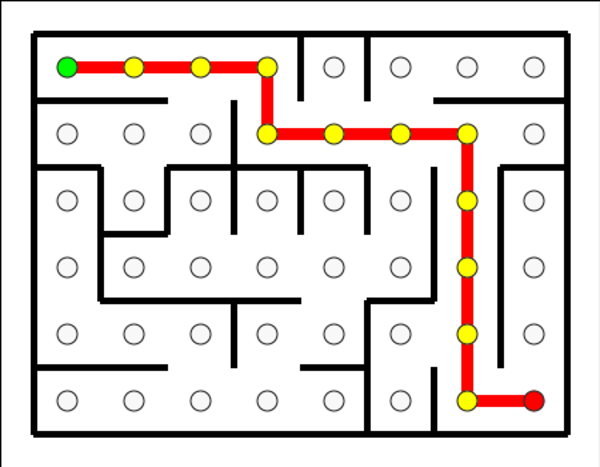
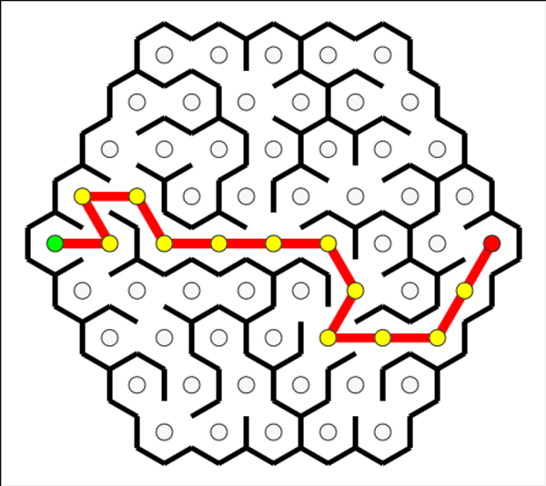

# Maze Generation v3

An elegant TypeScript library for generating mazes with mathematically precise rendering for both rectangular and hexagonal grids.

## Visual Examples

### Rectangular Maze


### Hexagonal Maze  


## Features

- **Multiple Grid Types**: Rectangular and hexagonal maze generation
- **Mathematical Precision**: Geometrically correct wall lengths derived from first principles  
- **Clean Architecture**: Separated topology computation from rendering via `Grid.toRenderable()`
- **Visual Validation**: Generate SVG output with solution paths highlighted
- **Property-Based Testing**: Validates maze connectivity and spanning tree properties

## Project Structure

- `src/` - Core maze generation library
- `lib/` - Compiled library output
- `web/` - Web interface files
- `tests/` - Test suites for maze algorithms

## Development

```bash
npm install
npm run build
npm test
```

## Quick Start

Generate mazes with the new unified rendering system:

```bash
# Generate rectangular maze
npx ts-node -e "
import { RectangularGrid } from './src/rectangular-grid';
import { generateMaze } from './src/maze-generator';
import { solveMaze } from './src/maze-solver';
import { SimpleRenderer } from './src/simple-renderer';
import { writeFileSync } from 'fs';

const grid = new RectangularGrid(6, 4);
const maze = generateMaze(grid);
const solution = solveMaze(maze);
const renderable = grid.toRenderable(maze, solution || undefined);
const renderer = new SimpleRenderer();
const svg = renderer.render(renderable);
writeFileSync('my-maze.svg', svg);
console.log('Generated my-maze.svg');
"

# Generate hexagonal maze
npx ts-node -e "
import { HexagonalGrid } from './src/hexagonal-grid';
import { generateMaze } from './src/maze-generator';
import { solveMaze } from './src/maze-solver';
import { SimpleRenderer } from './src/simple-renderer';
import { writeFileSync } from 'fs';

const grid = new HexagonalGrid(3);
const maze = generateMaze(grid);
const solution = solveMaze(maze);
const renderable = grid.toRenderable(maze, solution || undefined);
const renderer = new SimpleRenderer();
const svg = renderer.render(renderable);
writeFileSync('my-hex-maze.svg', svg);
console.log('Generated my-hex-maze.svg');
"

# View in browser
open my-maze.svg
```

## Mathematical Foundations

Wall lengths are derived mathematically for perfect geometric accuracy:

- **Rectangular**: Wall length = 1.0 (spans cell boundaries exactly)
- **Hexagonal**: Wall length = distance ÷ √3 ≈ 0.577 (hexagon side length)

This eliminates gaps and overshooting, ensuring clean visual rendering at any scale.